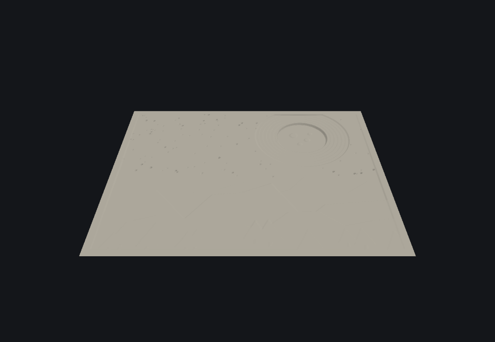
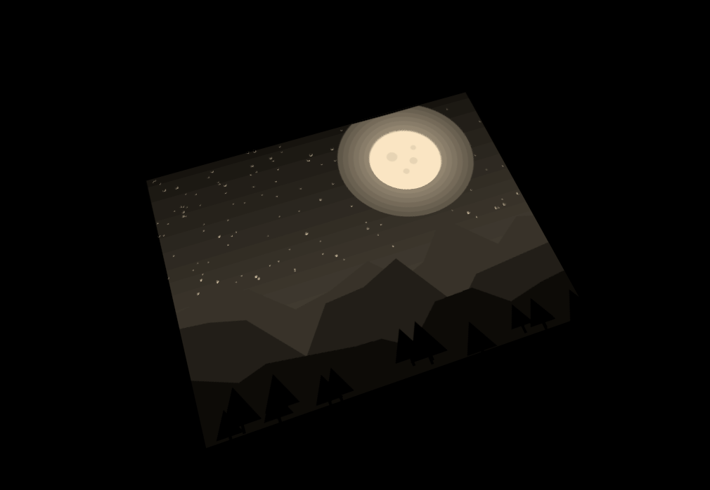
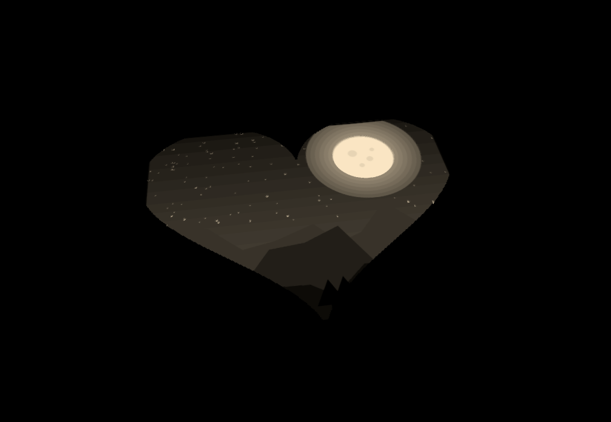

# MyLitho

A locally-hosted lithophane generator: upload a photo, adjust it with a live
3D preview, and export a print-ready STL. Built as a personal, self-hosted
alternative to itslitho.com for producing lithophanes for an Etsy shop.

Everything runs on your machine — no cloud processing, no accounts, no rate
limits.

## Screenshots

<table>
<tr>
<td align="center"><b>Source photo</b></td>
<td align="center"><b>Live preview</b></td>
<td align="center"><b>Simulated backlight</b></td>
</tr>
<tr>
<td></td>
<td></td>
<td></td>
</tr>
</table>

Same panel, same settings — toggling **Simulate backlight** shows exactly
how it'll look with a light behind the print, which is the best way to
judge contrast before committing to a print.

<p align="center">
  
  <br>
  <sub>Same photo, cropped to a heart-shaped ornament</sub>
</p>

## Features

- **Live 3D preview** (Three.js) that updates instantly as you drag sliders,
  at a resolution that tracks your Detail setting so the preview isn't
  blocky even at high detail
- **Crop, pan, and zoom** — drag the photo to reposition it and scroll/slide
  to zoom before it's baked into the panel, instead of always using the
  whole image squashed to fit
- **Simulated backlight preview** — a one-click toggle that switches the
  preview to an unlit, glowing render approximating how the print looks
  with a light behind it, so you can judge contrast/detail before printing
- **Shapes**: flat rectangular panel, curved wrap (for lamps/cylinders),
  circle/ornament, and heart
- **Border/mat** — an optional flat-thickness border baked right into the
  panel, like a picture-frame mat, in any shape
- **Optional hanging hole** for ornaments
- **Optional companion parts**, exported as separate STL files sized to fit
  the panel (border included): an LED backlight box with a matching cap
  (drop the panel in from the top — it slides down and locks into a
  retaining channel, no glue — then press the cap on to close the top up)
  and a snap-on frame (rabbeted
  so the panel friction-fits into it)
- Adjustable size, min/max thickness, mesh detail/resolution, brightness,
  contrast, gamma, and invert
- Output is a watertight, manifold mesh ready to slice directly — no repair
  needed in your slicer
- **Recent projects** — every STL export is saved locally (photo + every
  setting), so you can click back into a past order instead of
  reconstructing it. Stored only on your machine, never uploaded anywhere

## Run (macOS, easiest)

Double-click **`run.command`** in Finder. First run installs everything
automatically (takes a minute); every run after that starts instantly.
Your browser opens to the app on its own. To stop it, close the terminal
window that pops up (or press Ctrl+C in it).

If macOS blocks it as an unidentified script the first time, right-click
`run.command` → **Open** → confirm.

## Setup (manual / other platforms)

Requires Python 3.10+.

```bash
cd MyLitho
python3 -m venv .venv
source .venv/bin/activate
pip install -r requirements.txt
```

## Run (manual)

```bash
source .venv/bin/activate
uvicorn app.main:app --host 127.0.0.1 --port 8420
```

Then open http://127.0.0.1:8420 in your browser.

## Using it

The **Recent** strip at the top saves itself — every time you click
Download STL, that photo and its full settings get added there. Click a
thumbnail any time to reopen it exactly as it was, including the crop.
Hover a tile for a small **×** to remove it from history.

1. Choose a photo.
2. Set the physical size (width/height in mm) — aspect ratio locks to the
   photo by default.
3. Optionally add a **Border / mat** — a flat, uniform-thickness rim baked
   around the image, like a picture-frame mat. It follows whatever shape
   you pick (rectangular, heart outline, etc).
4. Use **Crop & position** to control exactly what shows: drag the photo to
   reposition it, scroll or use the Zoom slider to crop in tighter. At
   1.0x zoom you get a "cover" fit — the largest region of the photo that
   matches your panel's aspect ratio, with nothing squashed or distorted.
   Click **Reset** to go back to that default framing.
5. Pick a shape. Curved wrap needs a curve angle (degrees the panel bends
   through); circle/heart clip the panel (and its border) to that outline.
6. Dial in min/max thickness. Min thickness is the brightest/thinnest area
   (lets the most light through); max thickness is the darkest/thickest
   area — the border is solid at max thickness. A good starting point for
   FDM printing is 0.8mm min / 3.0mm max with a 0.4mm nozzle — thinner min
   than your nozzle can reliably extrude will look inconsistent.
7. Bump the **Detail** slider for finer surface resolution on close-up or
   high-contrast photos — this also sharpens the live preview, not just
   the export. Higher detail means a heavier mesh and slower export
   (boolean-based shapes — circle, heart, the frame, the box — take longer
   at high detail).
8. Toggle **Simulate backlight** above the viewer to see an approximation
   of how the print glows with a light behind it — this is the best way to
   catch contrast problems (too washed out, or too dark/muddy) before you
   commit to printing. It's preview-only; it doesn't affect the export.
   This view is rendered from a separate, higher-resolution image sent
   just for display, so it stays sharp even on small panels or low Detail
   settings where the print mesh itself is coarse.
9. Optionally enable the backlight box and/or snap-on frame (flat shape
   only). These export as their own STL files, sized to fit the panel
   (border included) with a small tolerance. Enabling the box also
   exports a matching **cap** — drop the panel into the box from the top;
   it slides down through the LED cavity and locks into a retaining
   channel sized to the panel's own thickness, so it can't tip out the
   front or slide back into the cavity — then press the cap on to close
   it up. The box's **Lip** setting controls how much of the panel's edge
   the retaining channel covers — bigger holds it more securely, smaller
   shows more of the image.
10. Click **Download STL**. A single shape downloads as a `.stl`; if you've
    enabled the box or frame it downloads as a `.zip` with all the parts.

The in-browser preview matches the exported file's resolution almost
exactly at typical sizes (e.g. a 100mm panel at the default 2.5 pts/mm
detail renders at the *same* 250x250 grid in both preview and export).
It only falls a bit behind the export at the extreme end — very large
panels combined with max Detail — since the preview is still capped a bit
lower than boolean-free (flat/curved) exports to stay smooth in the
browser. Novelty shapes (circle/heart) are capped lower on export than in
preview, because clipping them to their outline is a boolean operation
that gets slow at high resolution — so for those two shapes the preview
can actually look *finer* than the final file. If you want to sanity-check
resolution for your own settings: preview and export both derive from the
same `width_mm/height_mm x Detail`, so bumping Detail sharpens both
together.

## Print settings

The STL this app produces is only half the story — a perfect mesh sliced
with defaults (0.2mm layers, low infill) will still come out banded and
inconsistent. These settings are synthesized from itslitho's own
[slicer settings guide](https://itslitho.com/itslitho-blog/slicer-settings-for-lithophanes-tweaking-to-perfection/)
and several other lithophane-specific guides, cross-checked against each
other:

| Setting | Value | Why |
|---|---|---|
| Layer height | 0.12mm (0.08–0.12mm) | The single biggest factor. At 0.2mm, gradients visibly band; at 0.12mm they smooth out. Below ~0.08mm adds print time without a visible gain. |
| Infill | 100% | A lithophane's whole trick is controlling how much light gets through solid material — any void shows up as an odd bright/dark patch. (Alternative: 6–7+ perimeter walls with lower infill gives similar results with less filament, if your slicer version handles it well.) |
| Print speed | 30–50mm/s | Slower is smoother; speed shows up directly as ripple on a backlit print. |
| Filament | White or natural PLA | Best, most even light transmission. Colored/dark filaments block more light and need a re-tuned thickness range. |
| Cooling | 100% after layer 1–2 | No overhangs to fight here, so full cooling is safe and helps fine detail hold its shape. |
| Brim | 5–8mm | Cheap insurance against warping/lifting on a print that's mostly one big flat-ish shape. |

(We looked at auto-embedding these into a 3MF project file for one-click
setup in Creality Print/OrcaSlicer, but the settings didn't come through
reliably on an actual test — that side-channel is undocumented and
slicer-version-dependent, so it's not worth the false confidence. Enter
these by hand; it only takes a minute.)

### Advanced: vertical orientation for extra-smooth gradients

Standing a flat panel on edge (image facing forward) instead of printing
it flat moves the thickness gradient from Z-axis layer stacking to X-Y
toolpath positioning, which is far more precise — this all but eliminates
banding on gradual tones, and is why ItsLitho itself recommends it for
maximum quality.

The tradeoff is print time: layer count now scales with the panel's
*height* instead of its *thickness*. A 100mm-tall panel that prints in
roughly 30 minutes flat (25 layers at 3mm ÷ 0.12mm) can take 6+ hours
standing up (830 layers at 100mm ÷ 0.12mm). For a shop optimizing for
turnaround, flat is almost always the right default — this is worth
reaching for on a hero piece, not routine orders.

To do it: import the STL into your slicer, rotate it 90° so it stands on
one edge with the image facing you, and add a brim — the tall, thin
footprint is more prone to toppling or warping than printing flat. Curved
wrap lithophanes already get this benefit automatically, since they have
to stand upright to wrap around a cylinder.

### Preparing your photo

- High contrast and a clean, distinct subject read best — very flat/washed
  out photos benefit from the Contrast slider or a quick edit beforehand.
- Sharp focus matters more than resolution — a soft or blurry source photo
  stays soft no matter how high you push the Detail slider.
- Use the crop tool to fill the frame with your subject rather than
  leaving a lot of empty background — background detail mostly wastes the
  panel's dynamic range.

## How it works

- `app/imaging.py` — resamples the photo to a heightmap grid, with
  brightness/contrast/gamma/invert applied server-side. `crop_to_frame`
  extracts the sub-rectangle chosen by the crop editor (matching the
  panel's aspect ratio) before anything else happens, so cropping is a
  real pixel-level operation, not a display trick. Also renders a
  separate, higher-resolution grayscale PNG (`build_backlight_texture`)
  used only for the Simulate Backlight preview — it's sampled per-pixel
  by the GPU as a texture rather than interpolated per-vertex like the
  mesh's own geometry, so the backlit preview doesn't inherit the print
  mesh's (deliberately capped) resolution.
- `static/js/crop.js` — the drag-to-pan/zoom crop editor. Its state is
  three numbers (scale, center_x, center_y, as fractions of the source
  photo) that map directly onto `crop_to_frame`'s parameters, so the crop
  shown in the editor is exactly what the server crops to.
- `app/shapes.py` — converts the heightmap into vertex grids for flat and
  curved panels, and clips novelty shapes (circle/heart) via a boolean
  intersection with an extruded polygon.
- `app/geometry.py` — stitches a heightmap vertex grid (top surface, flat
  or curved backing, and side walls) into a single watertight solid — the
  same top/bottom/wall-stitching approach used by most open-source
  lithophane generators (e.g.
  [jamesphilbrick/lithophane-generator](https://github.com/jamesphilbrick/lithophane-generator)).
- `app/accessories.py` — parametric backlight box, cap, and snap-on frame,
  built from primitive boxes combined with boolean operations
  ([trimesh](https://trimesh.org/), [manifold3d](https://github.com/elalish/manifold) engine).
  The box's interior is four stages front-to-back: a full-width LED
  cavity, a narrow "back cap" shoulder, a full-width retaining channel
  sized to the panel's own thickness (`max_thickness_mm` + tolerance),
  and a narrow "front cap" shoulder (see `_box_depth_stages()`). All four
  are open at the top, so the panel drops straight down through the
  cavity and settles into the channel — once there it's captured
  front-to-back by both shoulders, so it can neither tip out the front
  nor slide backward into the cavity, and gravity plus the solid floor
  hold it on the other three sides — no glue required. Left, right, and
  bottom are otherwise fully closed, so only the top needs closing up
  afterward — that's what the cap is for: a flat flange that rests on the
  box's walls with a four-piece "tongue" on its underside (shaped to
  match the box's own four-stage opening, via the shared
  `_box_depth_stages()` helper so the two never drift apart) that presses
  down into the gap for a snug, glue-free friction fit. The cord slot cuts
  through the back wall (not the bottom), so the box still sits flat on a
  table.
- `static/` — the frontend. `meshgen.js` mirrors the flat/curved position
  math from `shapes.py` in JavaScript so the live preview can rebuild
  instantly on the client without a round trip for every slider tweak;
  image adjustments, size, and border changes trigger a server call to
  `/api/preview` (they change the heightmap itself), while shape/thickness/
  curve changes redraw instantly from the already-fetched heightmap.
- The **border** is implemented by padding the heightmap with 0.0-value
  pixels before meshing (`imaging.apply_border`) — since a 0.0 pixel maps
  to max thickness under the existing thickness formula, this reuses all
  the normal mesh-building and shape-masking code with no special case.
- The **backlight preview** renders a separate server-side texture (see
  `build_backlight_texture` above) with an unlit material on a black
  background, so thin/bright areas glow and thick/dark areas stay dark.
- `app/projects.py` — the Recent list's persistence: a small SQLite index
  (`data/projects.db`) plus the exact original photo bytes (no
  re-encoding) and a JPEG thumbnail per project, under `data/projects/`.
  Saved automatically on every STL export, best-effort — a save failure
  never blocks the actual download. Capped at 200 entries, oldest deleted
  first. `data/` is gitignored since it can contain customer photos.

## Notes for production use

- Boolean operations (circle/heart shapes, hanging hole, backlight box,
  snap-on frame) are the slowest part of export. If you're batching many
  orders, keep **Detail** moderate for those shapes unless you need the
  extra resolution.
- The snap-on frame's pocket depth needs to be deeper than your panel's
  max thickness for the panel to sit flush — increase **Frame Depth** if
  parts are protruding.
- Project history (photos + settings from past exports) lives in `data/`
  next to the app. Delete that folder any time to wipe it — it's
  regenerated automatically on the next export.
